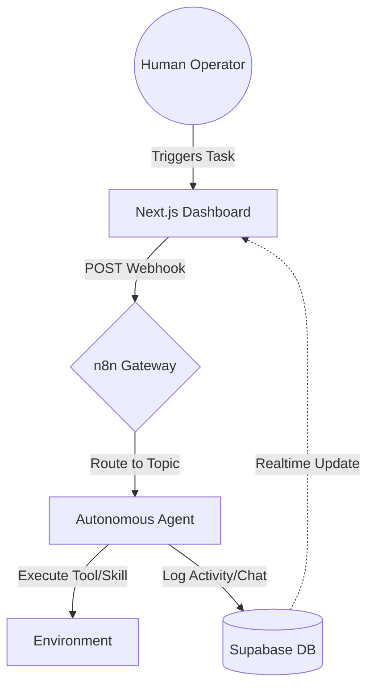

# 🕵️‍♂️ OpenClue — Mission Control Platform

> **The Central Intelligence Hub for Multi-Agent Orchestration.**

OpenClue is a professional-grade, real-time command center designed to monitor, manage, and orchestrate a fleet of autonomous AI agents. Built with a "Gateway First" philosophy, it leverages **Next.js 14**, **Supabase**, and **n8n** to provide a resilient, decoupled bridge between human operators and AI agents working across secure Telegram Topics and WhatsApp channels.

---

[](https://nextjs.org/)
[](https://supabase.com/)
[](https://n8n.io/)
[](https://www.typescriptlang.org/)
[](https://tailwindcss.com/)

---

## 🏗️ Technical Architecture (The Gateway Pattern)

OpenClue has evolved from a traditional monolithic backend to a modern **Gateway Architecture**. This shift ensures that agents remain decoupled from the UI, allowing for independent updates and extreme resiliency.

### The Ecosystem
*   **The Brain (n8n):** Handles all business logic, webhook routing, and agent communication. It acts as the "Traffic Controller," directing tasks to the correct agent based on path-based routing (`/n8n-promo`, `/n8n-digit`, etc.).
*   **The Memory (Supabase):** A PostgreSQL powerhouse that manages state, persists conversation history, and broadcasts real-time events to the dashboard via WebSockets.
*   **The Eyes (Next.js Dashboard):** A high-performance interface that consumes data directly from Supabase and triggers workflows via authenticated n8n webhooks.

### Data Flow Diagram


---

## ✨ Advanced Features

### 📊 Advanced Mission Control
*   **Live Performance Metrics:** Track system-wide progress with high-level KPIs (Project completion %, Agent uptime, Task density).
*   **Real-time Activity Stream:** A chronological, color-coded log of every internal thought, tool call, and system event generated by your agents.

### 🗂️ Lifecycle Project Management
*   **Granular Task Tracking:** Move tasks through `pending`, `in-progress`, `completed`, and `blocked` states.
*   **Automated Assignments:** When a task is assigned to an agent, the system automatically maps the request to that agent's specific Telegram Topic ID.

### 📅 Intelligent Visual Timeline
*   **Operational Gantt:** A visual representation of task overlapping and project health.
*   **Proactive Alerts:** Visual cues for overdue tasks and bottleneck identification.

### 💬 Unified Conversation Monitor (The "Clean View")
*   **Session-Centric Chat:** Conversations are grouped by `sessionKey`, allowing you to follow specific client interactions from start to finish.
*   **Metadata Stripping:** Built-in regex engine automatically strips JSON wrappers and internal metadata from agent responses, presenting a "Human-First" chat interface.
*   **Multi-Channel Bridge:** Monitor Telegram and WhatsApp side-by-side.

---

## 🤖 The Elite Agent Fleet

OpenClue manages a specialized hierarchy of agents, each with a dedicated role and communication channel:

| Agent | Role | Focus Area | Channel Mapping |
| :--- | :--- | :--- | :--- |
| **Mehzam** | CEO | Strategy & Orchestration | `Topic: 1` (Main) |
| **Promo** | CMO | Marketing & Outreach | `Topic: 1239` (Promo) |
| **Digit** | CFO | Finance & Reporting | `Topic: 3` (Digit) |
| **String** | COO | Infrastructure & Ops | `Topic: 2` (String) |

---

## 🚀 Deployment & Installation

### 1. Environment Configuration
Create `frontend/.env.local` with the following keys:

```env
NEXT_PUBLIC_SUPABASE_URL=your_supabase_url
NEXT_PUBLIC_SUPABASE_ANON_KEY=your_anon_key
NEXT_PUBLIC_N8N_BASE_URL=https://your-n8n-instance.com/webhook
```

### 2. Database Setup
Execute the `supabase-schema.sql` in your Supabase SQL editor. This script initializes:
*   **Relational Tables:** `agents`, `projects`, `tasks`, `conversations`.
*   **Realtime Publication:** Enables the `supabase_realtime` publication for all core tables.
*   **Security Policies:** Configures Row Level Security (RLS) to ensure data integrity.

### 3. Frontend Bootstrap
```bash
cd frontend
npm install
npm run dev
```

---

## 📂 System Structure

```bash
OpenClue/
├── frontend/                # Next.js 14 (App Router)
│   ├── app/                # Pages: Dashboard, Projects, Timeline, Conversations
│   ├── components/         # Atomic UI: Panels, Cards, Modals, Chat Bubbles
│   ├── hooks/              # Custom React Query + Realtime hooks
│   └── lib/                # Logic: n8n trigger library, Supabase client
├── plugin/                  # Agent-side plugin for tool call interception
├── hook/                    # Agent-side hook for session event logging
├── supabase-schema.sql     # Database source of truth
└── CLIENT_TASKS.md         # Active roadmap and requirement tracking
```

---

## 🐳 Docker Production Build

The platform is optimized for containerized environments (Coolify, Railway, or standard Docker):

```bash
docker build -t openclue-mission-control -f frontend/Dockerfile .
```

---
*Developed for high-stakes multi-agent orchestration. © 2026 OpenClue Team.*
